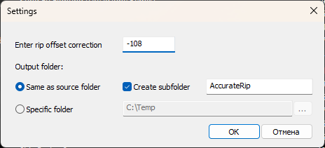

# foo_rip_offset (AccurateRip Offset Fixer)

[English](#english) | [Русский](#русский)

---

## English

**AccurateRip Offset Fixer** (`foo_rip_offset`) is a component for foobar2000 designed to perform bit-perfect sample shifting across track boundaries to correct AccurateRip drive offsets.

### Key Features

* **Bit-Perfect Sample Shifting:** Adjusts audio timing across track boundaries without loss of quality, correcting positive or negative drive offsets.
* **Complete Metadata Transfer:** Preserves all text tags (`file_info`) from the original files in the corrected `.fixed.wav` files.
* **Embedded Artwork Preservation:** Copies all embedded cover art types (Front, Back, Disc, Artist) to the output files.
* **Flexible Output Routing:** Save output files directly to the source directory, a custom path, or a dedicated subfolder.
* **Persistent Preferences:** Automatically saves dialog settings (paths, check states) across foobar2000 restarts.

### Usage

1. Select the tracks in your playlist that require offset correction.
2. Right-click the selection and choose **Apply Rip Offset...**.
3. Enter the required offset value in samples (e.g., `+30` or `-664`).
4. Select your preferred output directory and subfolder options.
5. Click **OK** to process the files.

---

## Русский

**AccurateRip Offset Fixer** (`foo_rip_offset`) — компонент для foobar2000, предназначенный для посэмплового сдвига аудиоданных через границы треков с целью коррекции привода по AccurateRip.

### Основные возможности

* **Bit-perfect коррекция оффсета:** Сдвигает аудиоданные с учетом соседних треков без перекодирования и потери качества, создавая `.fixed.wav` файлы.
* **Полный перенос метаданных:** Копирует все текстовые теги (`file_info`) из оригинальных треков в итоговые файлы.
* **Сохранение вшитых обложек:** Переносит все доступные типы обложек (Front, Back, Disc, Artist) в обработанные файлы.
* **Гибкая настройка вывода:** Возможность сохранять результат в исходную папку, произвольную директорию или автоматически создаваемый подкаталог.
* **Запоминание настроек:** Сохраняет выбор пользователя (пути, состояние чекбоксов) между запусками foobar2000.

### Использование

1. Выделите нужные треки в плейлисте foobar2000.
2. Нажмите правой кнопкой мыши и выберите **Apply Rip Offset...**.
3. Введите значение оффсета в сэмплах (например, `+30` или `-664`).
4. Настройте директорию сохранения и вложенную папку.
5. Нажмите **ОК** для запуска обработки.

---

### Building from Source

* **IDE:** Microsoft Visual Studio 2022 (C++ Desktop Development)
* **Dependencies:** foobar2000 SDK, WTL / ATL
* **Target:** `foo_rip_offset.dll` / Windows x86/x64
